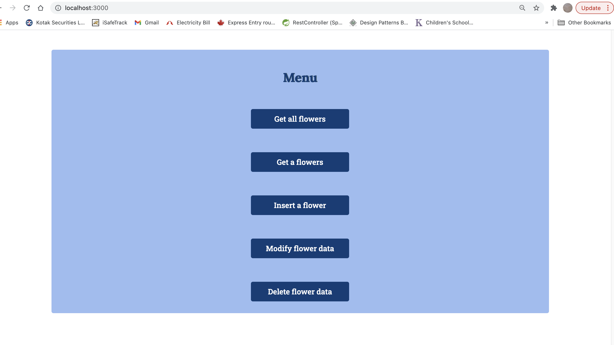

# Flower data storage

## Naik_Shubhangi_flowers.json

The flowerId is unique

```json
[
    {
        "flowerId":1,
        "name":"tulip",
        "stock":30,
        "site":"half shadow",
        "farmer":"Roses of Rovaniemi oy"
        },
    {
        "flowerId":2,
        "name":"lily-of-the-valley",
        "stock":5,
        "site":"bucket",
        "farmer":"Viola and Hyacinth Company"
        }
]
```

### Public API (methods of Datastorage)

#### dataStorageLayer.js

- getAll()
  - returns an array of all employees / []

- getOne(flowerId)
  - returns a flower object / NOT_FOUND

- insert(newFlower)
  - returns INSERT_OK / NOT_INSERTED / ALREADY_IN_USE

- update(flowerId)
  - returns UPDATE_OK / NOT_UPDATED

- REMOVE(flowerId)
  - returns REMOVE_OK / NOT_FOUND / NOT_REMOVED

 - getter for status codes
   - returns  status codes

   ### Private API

   #### readerWriter.js   (lower level handling)
   - readStorage(storageFile)
     - returns an array of flower / []

    - writeStorage(storageFile,data)
      - returns true / false

   #### storageLayer.js
   - getAllFromStorage()
     - returns an array of employees / []

    - getOneFromStorage(flowerId)
      - returns a flower object with given id / null 

    - addToStorage(newFlower)
      - retuns true / false

    - updateStorage(updatedFlower)
      - returns true / false

    - removeFromStorage(flowerId)
      - returns true / false

### status codes and messages
```json
const CODES = {
    PROGRAM_ERROR:0,
    NOT_FOUND:1,
    INSERT_OK:2,
    NOT_INSERTED:3,
    ALREADY_IN_USE:4,
    REMOVE_OK:5,
    NOT_REMOVED:6,
    UPDATE_OK:7,
    NOT_UPDATED:8
}
```

The Format of an status message is :
(status type are `error` or `ìnfo`)

```js
const MESSAGES ={
    PROGRAM_ERROR:()=>({
        message:'Sorry! Error in the program',
        code:CODES.PROGRAM_ERROR,
        type:'error'
    }),
    NOT_FOUND: flowerId => ({
        mwssage : `No flower found with id ${flowerId}`,
        code: CODES.NOT_FOUND,
        type:'error'
    }),
    INSERT_OK: ID=> ({
        message: `Flower ${flowerId} is inserted`,
        code:CODES.INSERT_OK,
        type:'info'
    }),
    ....
}
